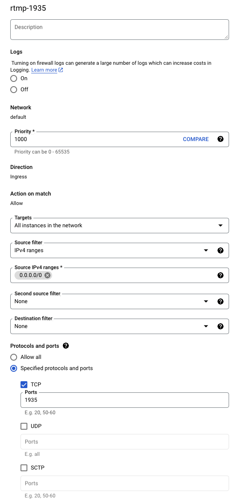

# Criando uma Regra de Firewall no Google Cloud para Liberar a Porta

RTMP: 1935
MINIO: 9001
NIFI: 9443

**1. Acesse o Console de Rede do Google Cloud**
No Google Cloud Console, navegue até a seção de Firewall:
No menu de navegação, vá para VPC Network > Firewall rules.

**2. Crie uma Nova Regra de Firewall**
Clique em Create firewall rule para iniciar a criação de uma nova regra.

Preencha os campos da seguinte maneira:

